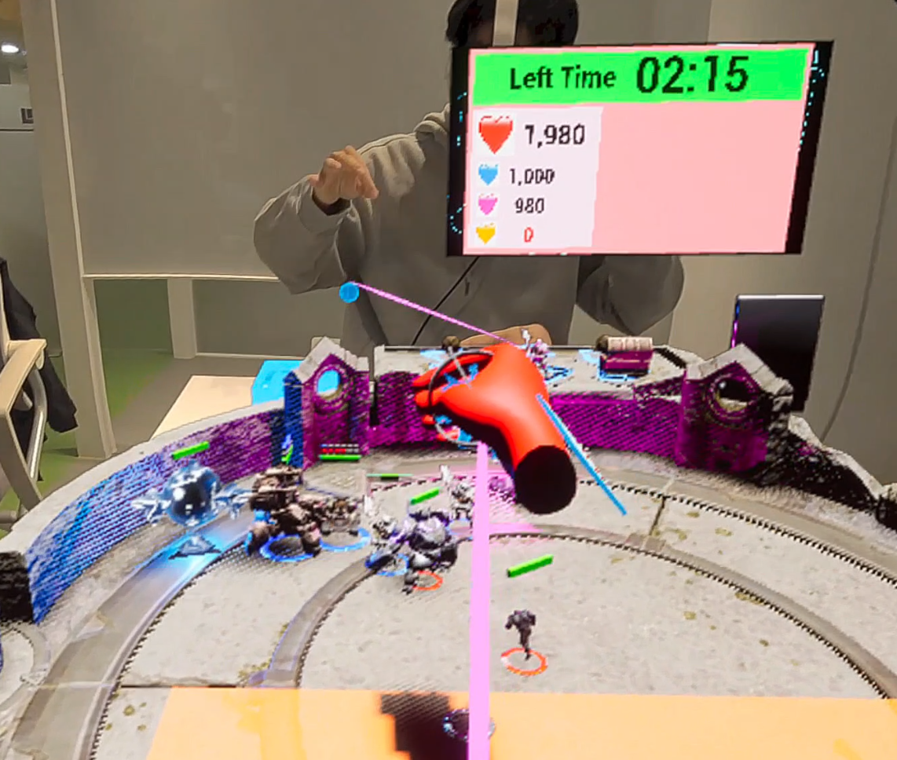
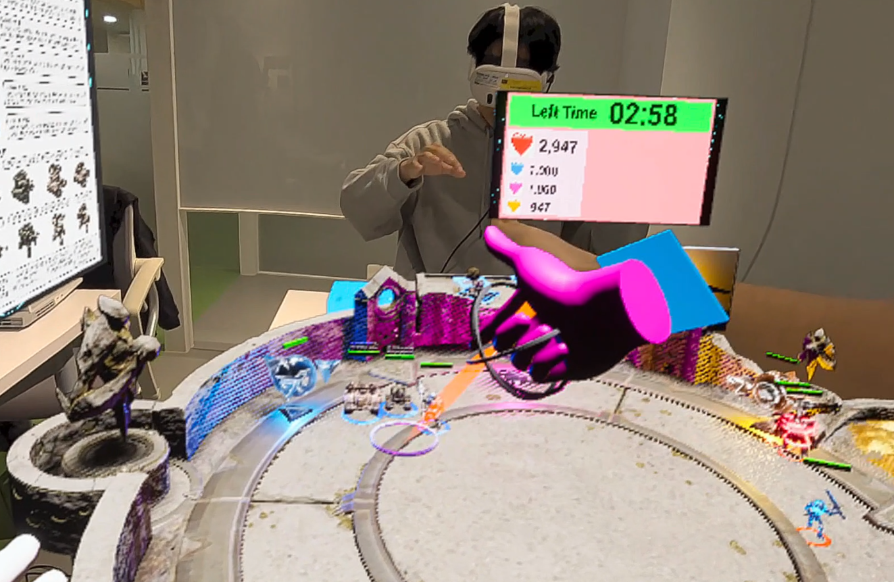

# XRDefenceGame

---

## About This Game

이 게임은 예전 해리포터 영화에서 보던 마법사 체스를 모티브로 만든 VR 보드 게임입니다.

플레아어가 보드게임의 말을 보드 위에 올려 놓게 되면, 말이 자기 스스로 살아 움직이면서 적을 공격하러 가거나, 적의 공격을 막아 줍니다.

이렇게 공격 측은 상대의 넥서스를 많이 깨는것이 최종 목표이고, 수비 측은 넥서스를 지키는 것이 최종 목표입니다.

또한 단순히 말을 보드 위에 놓는 것 만이 끝이 아니라, 손가락을 이용한 제스처 액션울 통해 실제 마술을 하며 보드 판과 상호작용 할 수 있도록 기능을 추가했습니다

## 팀 구성원
**권민규(팀장)** : **게임 개발** 및 게임 기획 참여

방현조 : 게임 기획 및 문서 자료 제작

정협 : 게임 기획 및 발표 자료 제작

이승한 : 게임 기획 및 테스트

## 수상 이력

본래 졸업 프로젝트로 시작한 게임 이었으나, 교수님의 추천으로 실감미디어 경진 대회에 출품을 하게 되었고,

졸업프로젝트 시상회와, 실감미디어 경진 대회 각각 최우수상, 대상을 받게 되어 좋은 성적을 거두었습니다.

## Development duration
**Version1.0** : 2024-8-14 ~ 2024-10-7

---

## Key Features

### Puzzle Solving and Treasure Hunting

Vast stages await exploration where players must solve puzzles to discover hidden treasures. The ultimate objective? Solve the puzzles, find the treasures, and escape.

---

### Combat or Avoidance

Face enemies head-on or choose to avoid them. Each encounter presents a choice that can affect your resources and progress.

---

### Limited Resources

Consumable items like bullets, keys, and healing supplies are scarce. Effective resource management becomes crucial to your survival.

---

### Inventory Management

Players have limited inventory space, requiring them to make critical decisions on what to carry. Choosing the right items will be key to advancing through the game.

---

### Messages from Predecessor Agents

Discover hints and tips left by previous agents across the map. These clues can provide valuable insights and help you overcome challenges.

---

