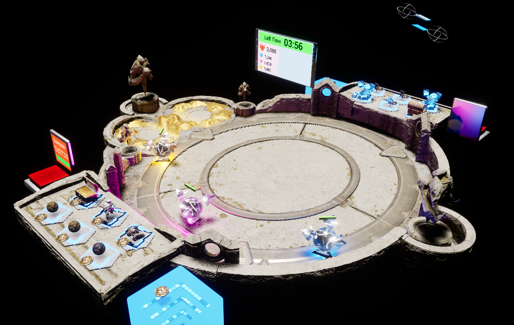

# XRDefenceGame
이 게임은 **VR 멀티 플레이** 보드게임 입니다

---

## About This Game

이 게임은 예전 해리포터 영화에서 보던 마법사 체스를 모티브로 만든 VR 보드 게임입니다.

플레아어가 보드게임의 말을 보드 위에 올려 놓게 되면, 말이 자기 스스로 살아 움직이면서 적을 공격하러 가거나, 적의 공격을 막아 줍니다.

이렇게 공격 측은 상대의 넥서스를 많이 깨는것이 최종 목표이고, 수비 측은 넥서스를 지키는 것이 최종 목표입니다.

또한 단순히 말을 보드 위에 놓는 것 만이 끝이 아니라, 손가락을 이용한 제스처 액션울 통해 실제 마술을 하며 보드 판과 상호작용 할 수 있도록 기능을 추가했습니다

## 팀 구성원
**권민규(팀장)** : **게임 개발** 및 게임 기획 참여

방현조 : 게임 기획 및 문서 자료 제작

정협 : 게임 기획 및 발표 자료 제작

이승한 : 게임 기획 및 테스트

## 수상 이력

본래 졸업 프로젝트로 시작한 게임 이었으나, 교수님의 추천으로 실감미디어 경진 대회에 출품을 하게 되었고,

졸업프로젝트 시상회와, 실감미디어 경진 대회 각각 **최우수상**, **대상(교육부장관상)**을 받게 되어 좋은 성적을 거두었습니다.

## 개발 방법 및 사용 에셋
위 게임은 **Unreal Engine 5.3**으로 개발이 되었으며,

게임에서 제공하는 **온라인 멀티 기능**은 **steam online subsystem**을 사용해서 개발을 하였습니다. 이 덕분에 서로 플레이어가 스팀에 접속해 있기만 하다면 공간에 상관 없이 서로 소통을 하며 멀티 플레이로 게임을 즐길 수 있습니다

또, 사용자의 손 제스처가 포즈 인식은 oculus에서 제공해 주는 **oculus hand tool 플러그인**을 사용하였습니다. 이 플러그인 덕분에 사용자가 현재 무슨 제스처를 취하고 있는 지를 알 수 있고, 이를 인풋으로 게임 로직을 짜봤습니다.

**공격 측 말 에셋 ** : https://www.fab.com/ko/listings/039ea035-9360-4e76-ad06-5d3a92da6f65 

**수비 측 말 에셋 ** : https://www.fab.com/ko/listings/515af6b5-6ec9-4efb-8d79-76b8d98b564b

**보드 판 및 테두리 에셋 ** : https://www.fab.com/ko/listings/6f401fb5-88b5-41b4-bf1b-62321414e1f0 

---

## 작품 소개서 

---

